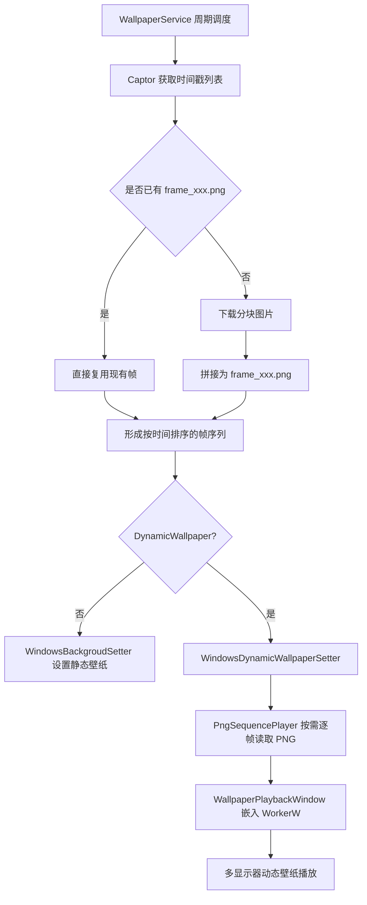

# EarthBackground


基于 `.NET 10` 和 `Avalonia` 的地球壁纸工具，支持静态壁纸和 Windows 动态壁纸。

项目当前重点是：
- 抓取卫星云图分块并拼接为完整图片
- 复用已有 `frame_xxx.png`，避免重复下载和重复拼接
- 在 Windows 上将 PNG 帧序列直接流式播放为动态壁纸
- 提供本地配置、下载进度、错误通知和多语言 UI

## 当前功能

### 抓取源
- `Himawari8` 向日葵 8 号
- `FY4B` 风云 4B

### 下载方式
- 直接下载
- Cloudinary
- 七牛云

### 壁纸模式
- 静态壁纸：抓取最新一帧并设置为系统壁纸
- 动态壁纸：抓取最近一段时间的多帧 PNG，循环播放为动态桌面

### 运行特性
- 支持多显示器动态壁纸播放
- 支持按帧缓存复用，已有 `frame_xxx.png` 时不再重复处理
- 支持受控并发下载和拼接，加快多帧生成速度
- 支持当帧集合未变化时跳过动态壁纸重建
- 支持主界面进度条显示下载、解析和播放准备进度
- 支持配置保存与开机自启动

## 动态壁纸实现

当前动态壁纸链路已经不再走“先生成 APNG，再解析 APNG 播放”的旧方案，而是改为直接播放 PNG 序列：

1. `WallpaperService` 周期性触发抓取
2. `Captor` 获取最近时间戳列表
3. 对缺失帧执行下载和拼接，已有帧直接复用
4. `WindowsDynamicWallpaperSetter` 对帧路径排序
5. `PngSequencePlayer` 按需逐帧读取 PNG
6. `WallpaperPlaybackWindow` 将帧内容绘制到嵌入 `WorkerW` 的 Avalonia 窗口

这样做的好处：
- 避免 APNG 编码和再次解析带来的额外耗时
- 降低播放前的峰值内存占用
- 更适合“抓一批帧然后循环播放”的桌面壁纸场景

## 架构流程图



## 项目结构

`src` 下的主要模块：

- `Background`
  - 壁纸服务循环
  - Windows 静态/动态壁纸设置
  - WorkerW 嵌入和多显示器区域管理
- `Captors`
  - 各卫星抓取器
  - 分块下载、缓存命中、图片拼接
  - 多帧并发处理
- `Imaging`
  - PNG 序列播放器
  - 动态壁纸帧播放器接口
  - 早期 APNG 相关实现
- `Oss`
  - 直接下载
  - Cloudinary
  - 七牛云
- `Views`
  - Avalonia 窗口
  - 动态壁纸播放窗口
- `ViewModels`
  - 主界面逻辑
  - 设置界面逻辑
- `Localization`
  - 基于 `.resx` 的 UI 文本本地化

## 工作流程

### 静态壁纸
- 获取最新时间戳
- 下载缺失分块
- 拼接为完整 PNG
- 设置为系统壁纸

### 动态壁纸
- 获取最近 `RecentHours` 的时间戳列表
- 对每个时间戳检查是否已有 `frame_xxx.png`
- 缺失帧才下载并拼接
- 最终按时间顺序播放 PNG 帧序列

## 配置说明

主要配置位于 `appsettings.json`：

- `CaptureOptions`
  - 抓取器
  - 分辨率
  - 抓取间隔
  - 缩放比例
  - 是否动态壁纸
  - 最近时长
  - 循环停顿
  - 保存路径
- `OssOptions`
  - 下载方式
  - 用户名
  - API Key / Secret
  - Domain / Bucket / Zone

历史配置说明仍可参考：

- [配置详解](https://github.com/LGinC/EarthBackground/wiki)

### 示例配置

```json
{
  "CaptureOptions": {
    "ImageIdUrl": "json/himawari/full_disk/geocolor/latest_times.json",
    "Captor": "fy-4b",
    "AutoStart": false,
    "SetWallpaper": true,
    "SaveWallpaper": false,
    "WallpaperFolder": "images",
    "SavePath": "images",
    "Resolution": 2,
    "Zoom": 80,
    "Interval": 20,
    "DynamicWallpaper": true,
    "FrameIntervalMs": 500,
    "RecentHours": 24,
    "LoopPauseMilliseconds": 3000
  },
  "OssOptions": {
    "CloudName": "DirectDownload",
    "UserName": "",
    "ApiKey": "",
    "ApiSecret": "",
    "Zone": "",
    "Bucket": "",
    "Domain": "",
    "IsEnable": true
  }
}
```

字段说明补充：
- `Captor`
  - `Himawari8`
  - `fy-4b`
- `Resolution`
  - `0` = `688 x 688`
  - `1` = `1376 x 1376`
  - `2` = `2752 x 2752`
  - `3` = `5504 x 5504`
  - `4` = `11008 x 11008`
- `CloudName`
  - `DirectDownload`
  - `Cloudinary`
  - `Qiniuyun`
- `DynamicWallpaper`
  - `true` 时使用最近一段时间的 PNG 帧序列播放动态壁纸
- `FrameIntervalMs`
  - 每帧播放间隔，单位毫秒
- `RecentHours`
  - 回溯最近多少小时的时间戳来构建动画
- `LoopPauseMilliseconds`
  - 一轮播放完成后的停顿时间，单位毫秒

## 开发与运行

### 本地运行

```powershell
dotnet run --project .\src\EarthBackground.csproj
```

### 构建

```powershell
dotnet build .\src\EarthBackground.csproj
```

### 后台服务模式

```powershell
dotnet run --project .\src\EarthBackground.csproj -- --service
```

## 当前界面

项目已经迁移到 Avalonia 桌面 UI，主界面包含：
- 当前状态
- 总体进度条
- 开始 / 停止 / 设置 / 退出

设置页包含：
- 抓取设置
- 动态壁纸相关参数
- 下载器配置
- 保存路径选择

## 说明

- 动态壁纸当前主要面向 Windows
- Linux / macOS 的静态壁纸设置接口已保留，但能力未像 Windows 动态壁纸那样完整
- 仓库中仍保留部分 APNG 相关代码，主要用于过渡和后续兼容实验，当前默认播放路径是 PNG 序列
