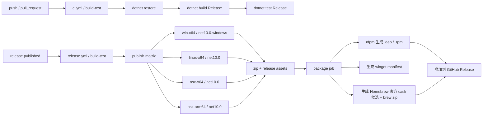

# 发布说明

## 发布流程

GitHub Actions 拆成两个 workflow：

- `.github/workflows/ci.yml`：`push` / `pull_request` 到 `master` 时跑 `build-test`
- `.github/workflows/release.yml`：`release: published` 时跑 `build-test` → `publish` → `package` → feeds / Homebrew / winget



- `publish` job 仍然是唯一构建来源，先生成各平台 `dotnet publish` 目录与 zip。
- `package` job 仅在 GitHub Release 触发时运行，复用现有 artifacts 继续产出：
  - `EarthBackground-<version>-linux-x64.deb`
  - `EarthBackground-<version>-linux-x64.rpm`
  - `dist/winget/...` 下的 `winget` manifest
  - `dist/homebrew-official/**` 下的 Homebrew 官方 cask 候选材料
  - `dist/packages/apt` 与 `dist/packages/yum` 下的仓库元数据
- `publish-package-feeds` 会把 `.deb` / `.rpm` 及其索引同步到仓库 `gh-pages` 分支：
  - `https://<owner>.github.io/<repo>/packages/apt`
  - `https://<owner>.github.io/<repo>/packages/yum`
- `apt` 仓库会由 `apt-ftparchive` 生成 `Packages` / `Packages.gz` / `Release`，并在配置签名密钥后额外生成 `InRelease` / `Release.gpg`。
- `yum` 仓库元数据由 `createrepo_c` 生成；配置签名密钥后会额外生成 `repodata/repomd.xml.asc`。
- 仓库签名为可选启用，需配置以下 secrets：
  - `PACKAGE_FEED_GPG_PRIVATE_KEY`：ASCII armored 私钥
  - `PACKAGE_FEED_GPG_PASSPHRASE`：私钥口令
  - `PACKAGE_FEED_GPG_KEY_ID`：可选，指定签名 key id
- `publish-homebrew-official-pr` 在配置官方 fork 与 token 后会 best-effort 自动向 `Homebrew/homebrew-cask` 发起 PR。
- `publish-winget` 在配置 `secrets.WINGET_PAT` 后自动向 `winget-pkgs` 提交更新。

## 官方仓库与自建仓库建议

### Homebrew

- 当前仓库已经可以自动生成 Homebrew 官方 cask 候选材料。
- release 后会产出 `dist/homebrew-official/**`，并可在配置 fork/token 后 best-effort 自动向 `Homebrew/homebrew-cask` 发起 PR。
- macOS release 会把 `dotnet publish` 输出重新打包为标准 `EarthBackground.app` bundle，并同时生成 `.app.zip` 与 `.dmg`。
- 构建脚本会优先尝试从现有 `earth.ico` 自动生成 `EarthBackground.icns`；若 runner 上图标转换失败，仍会保留可运行的 `.app`，但图标资源会退回到非标准状态。
- 当前自动生成的 Homebrew cask 已包含：
  - `app "EarthBackground.app"`
  - `livecheck`
  - `depends_on`
  - 最小 `zap`
- 其中 `zap` 路径基于 bundle identifier 推断，提交官方前仍应在真实 macOS 安装环境复核一次。
- 官方收录仍取决于 Homebrew 审核，而不是本仓库 workflow 单方面决定。

### APT / Debian / Ubuntu

- 当前仓库已经具备 **自建 APT 仓库** 所需的 `.deb`、索引、签名能力。
- 但这不等于已经满足 Debian / Ubuntu **官方仓库**收录要求。
- 官方发行仓库通常还需要：
  - 更标准的 Debian 打包流程
  - 符合 Debian Policy 的源码包与元数据
  - 持续维护和审核流程

结论：

- 现阶段更适合继续维护 **自建 APT 仓库**
- 不建议把 Debian / Ubuntu 官方仓库作为近期目标

### YUM / Fedora / EPEL

- 当前仓库已经具备 **自建 RPM 仓库** 所需的 `.rpm`、`createrepo_c` 元数据和可选签名。
- 但要进入 Fedora / EPEL 等官方生态，通常还需要：
  - 符合发行版规范的 RPM 打包维护方式
  - 更完整的 spec / source package 维护流程
  - 审核、许可、依赖、更新节奏等长期维护要求

结论：

- 现阶段更适合继续维护 **自建 RPM 仓库**
- Fedora / EPEL 官方仓库更适合作为后续成熟阶段目标

### 当前建议路线

按投入产出比，推荐顺序：

1. Homebrew：优先走官方 cask 候选与 best-effort PR 流程
2. APT：持续维护自建仓库
3. YUM：持续维护自建仓库

## 维护者发布手册

### 一次性准备

1. 启用 GitHub Releases。
2. 启用 GitHub Pages，并将发布源指向 `gh-pages` 分支。
3. 如需 best-effort 自动向 `Homebrew/homebrew-cask` 发起 PR：
   - 先准备一个你自己名下的 `Homebrew/homebrew-cask` fork
   - 配置 Repository variable：`HOMEBREW_CASK_FORK_REPOSITORY=<owner>/homebrew-cask`
   - 配置 Repository secret：`HOMEBREW_CASK_PAT=<可写入该 fork 且可创建 PR 的 GitHub PAT>`
   - `fork owner` 会从 `HOMEBREW_CASK_FORK_REPOSITORY` 自动解析
   - 该流程属于 best-effort 自动化，仍可能因为官方仓库规则、重复 PR、review 要求或 gh CLI 行为差异而需要人工收尾
4. 如需 winget 自动提交：
   - 配置 `WINGET_PAT`
5. 如需 APT / YUM 仓库签名：
   - `PACKAGE_FEED_GPG_PRIVATE_KEY`
   - `PACKAGE_FEED_GPG_PASSPHRASE`
   - 需要时配置 `PACKAGE_FEED_GPG_KEY_ID`
6. 当前 workflow 不再包含 macOS 签名与公证步骤。
   - 无 Apple Developer 账号时，release 仍会生成可分发的 `.app.zip` 与 `.dmg`
   - 但不会执行 `codesign`、`notarytool`、`stapler`

### 首次初始化建议

- 若仓库此前没有 `gh-pages` 分支，建议先手工创建一个空分支。
- 先手工创建一次 GitHub Release，确认：
  - release zip 已上传
  - `gh-pages/packages/apt` 与 `gh-pages/packages/yum` 已生成
  - 若配置了官方 PR 自动化：对应 fork 上已推送 `earthbackground-<version>` 分支，且 workflow summary 中能看到以下之一：
    - `Created official Homebrew PR: <url>`
    - `Existing official Homebrew PR: <url>`
    - `No official Homebrew cask changes for earthbackground-<version>.`
  - `dist/homebrew-official/Casks/earthbackground.rb` 已生成
  - `dist/homebrew-official/README.txt` 已生成
  - `dist/homebrew-official/PR-CHECKLIST.txt` 已生成
  - `dist/homebrew-official/PR-TEMPLATE.md` 已生成
  - 若配置了官方 PR 自动化：`homebrew-official-pr-result-<sha>` artifact 已生成，且其中 `forkOwner` 与 `HOMEBREW_CASK_FORK_REPOSITORY` 推导结果一致

### 每次 release 后检查

- GitHub Release 附件中应包含：
  - Windows / Linux zip
  - macOS zip（其中应包含 `EarthBackground.app`）
  - macOS `.dmg`
  - `.deb`
  - `.rpm`
  - `EarthBackground-<version>-osx-arm64-brew.zip`
- macOS release 当前会生成未签名、未公证的 `.app` 与 `.dmg`
- `gh-pages` 分支中应包含：
  - `packages/apt/Packages`
  - `packages/apt/Packages.gz`
  - `packages/apt/Release`
  - 签名启用时：`packages/apt/InRelease`、`packages/apt/Release.gpg`
  - `packages/yum/repodata/`
  - 签名启用时：`packages/yum/repodata/repomd.xml.asc`
  - 签名启用时：`packages/public.key`
- 若启用了 Homebrew / winget 自动发布，再检查对应外部仓库或 PR 状态。

### 常见失败与排查

#### `publish-package-feeds` 失败

- 现象：无法 push 到 `gh-pages`，或 `packages/apt`、`packages/yum` 没有更新。
- 优先检查：
  - `gh-pages` 分支是否存在
  - 仓库是否允许 GitHub Actions 写入 `contents`
  - GitHub Pages 是否已指向 `gh-pages`

#### 官方 Homebrew Cask 提交说明

- 当前 workflow 会生成官方 cask 候选文件和说明 artifact。
- 若同时配置以下项，还会尝试自动向 `Homebrew/homebrew-cask` 发起 best-effort PR：
  - `HOMEBREW_CASK_FORK_REPOSITORY`
  - `HOMEBREW_CASK_PAT`
- 我本次已用 Homebrew 官方文档核对并补齐候选文件中的这些关键元数据：
  - `livecheck`
  - `depends_on`
  - `zap`
- 其中 `zap` 路径目前是基于 `io.github.lginc.earthbackground` 推断出的最小集合，建议在 release 后的真实 macOS 安装环境中再核对一次。
- 建议在 release 后检查 `EarthBackground-packages-<sha>` artifact 中的：
  - `dist/homebrew-official/Casks/earthbackground.rb`
  - `dist/homebrew-official/README.txt`
  - `dist/homebrew-official/PR-CHECKLIST.txt`
  - `dist/homebrew-official/PR-TEMPLATE.md`
- 如果启用了官方 PR 自动化，再检查：
  - `homebrew-official-pr-result-<sha>` artifact
  - workflow summary 中的 created / existing / no_changes 状态
  - `homebrew-official-pr-result.json` 中的 `forkOwner` 是否与 `HOMEBREW_CASK_FORK_REPOSITORY` 推导一致
- 推荐提交流程：
  1. 先按 `PR-CHECKLIST.txt` 完成本地检查
  2. 再用 `PR-TEMPLATE.md` 作为向 `Homebrew/homebrew-cask` 提交 PR 的正文起点
  3. 如果已启用自动 PR，检查 action 是否成功推送到 fork 并成功创建 PR
  4. 根据 Homebrew maintainer 反馈继续调整 stanza 或 `zap` 路径
- 这条自动 PR 流程仍是 best-effort：即使 workflow 成功执行，也不代表官方一定接受或合并。

#### `publish-homebrew-official-pr` 失败

- 现象：没有推送到 fork、没有创建 PR，或 job 在 `gh` / `git` 步骤失败。
- 优先检查：
  - `HOMEBREW_CASK_FORK_REPOSITORY` 是否真的是你名下的 `homebrew-cask` fork
  - `HOMEBREW_CASK_FORK_REPOSITORY` 是否满足 `<owner>/homebrew-cask` 格式，便于 workflow 自动解析 fork owner
  - `HOMEBREW_CASK_PAT` 是否既能写 fork，又能用 GitHub CLI 创建 PR
  - workflow summary 是否显示：
    - `No official Homebrew cask changes ...`（说明候选 cask 与 fork 当前内容相同）
    - `Existing official Homebrew PR: ...`（说明 PR 已存在）
  - `dist/homebrew-official/Casks/earthbackground.rb` 与 `dist/homebrew-official/PR-TEMPLATE.md` 是否成功生成
  - `homebrew-official-pr-result-<sha>` artifact 是否生成，并检查其中 `status` / `url` / `forkOwner`
  - 若 `gh repo view Homebrew/homebrew-cask` 或 `gh pr create` 失败，通常需要回头检查 token 权限、fork 状态或 GitHub API 可用性

#### macOS 打包相关失败

- 现象：`.app` 或 `.dmg` 未生成，或 macOS artifact 结构不符合预期。
- 优先检查：
  - `packaging/macos/build-macos-app.sh` 是否成功执行
  - `publish/<runtime>/EarthBackground.app` 是否生成
  - `src/Assets/earth.ico` 是否存在；若图标转换失败，应用仍应继续构建，只是缺少标准 `.icns`
  - `hdiutil create` 是否成功产出 `.dmg`

#### `publish-winget` 失败

- 现象：没有创建 PR，或 action 在提交 manifest 时失败。
- 优先检查：
  - `WINGET_PAT` 是否有效
  - token 是否具备 fork / push / PR 权限
  - release 中是否存在 `win-x64` zip，且文件名仍匹配 `EarthBackground-.*-win-x64.zip`

#### APT / YUM 签名失败

- 现象：`InRelease`、`Release.gpg` 或 `repomd.xml.asc` 未生成，或 gpg 命令报错。
- 优先检查：
  - `PACKAGE_FEED_GPG_PRIVATE_KEY` 是否为 armored 私钥
  - `PACKAGE_FEED_GPG_PASSPHRASE` 是否正确
  - 若配置了 `PACKAGE_FEED_GPG_KEY_ID`，它是否确实存在于导入后的 keyring 中

#### APT / YUM 客户端安装失败

- 现象：`apt update` / `dnf install` 报仓库签名、元数据或包不存在。
- 优先检查：
  - `gh-pages/packages/apt` 与 `gh-pages/packages/yum` 是否已同步最新 release
  - `packages/public.key` 是否存在且客户端已正确导入
  - 文档中的 `<owner>`、`<repo>`、`<version>` 是否已替换成真实值

## 安装示例

以下命令中的 `<owner>`、`<repo>`、`<version>` 需要替换为实际值。

### winget

当 `winget-pkgs` PR 合并后：

```powershell
winget install LGinC.EarthBackground
```

### Homebrew

本仓库当前以 **生成官方 cask 候选材料** 为主，不再维护自建 tap。

若你要本地验证官方候选 cask，可在拿到候选文件后执行：

```bash
brew install --cask ./earthbackground.rb
```

向 `Homebrew/homebrew-cask` 提交时，优先使用 release 生成的 `PR-CHECKLIST.txt` 与 `PR-TEMPLATE.md`。

### apt

若已启用签名公钥发布，可先导入公钥：

```bash
curl -fsSL https://<owner>.github.io/<repo>/packages/public.key | sudo gpg --dearmor -o /usr/share/keyrings/earthbackground.gpg
echo "deb [signed-by=/usr/share/keyrings/earthbackground.gpg] https://<owner>.github.io/<repo>/packages/apt ./" | sudo tee /etc/apt/sources.list.d/earthbackground.list
sudo apt update
sudo apt install earthbackground
```

如果暂时未启用签名：

```bash
sudo apt install ./EarthBackground-<version>-linux-x64.deb
```

### dnf / yum

若已启用签名公钥发布，可创建 repo 文件：

```bash
sudo tee /etc/yum.repos.d/earthbackground.repo >/dev/null <<'EOF'
[earthbackground]
name=EarthBackground
baseurl=https://<owner>.github.io/<repo>/packages/yum
enabled=1
gpgcheck=1
repo_gpgcheck=1
gpgkey=https://<owner>.github.io/<repo>/packages/public.key
EOF

sudo dnf install earthbackground
```

如果暂时未启用签名：

```bash
sudo dnf install ./EarthBackground-<version>-linux-x64.rpm
```
